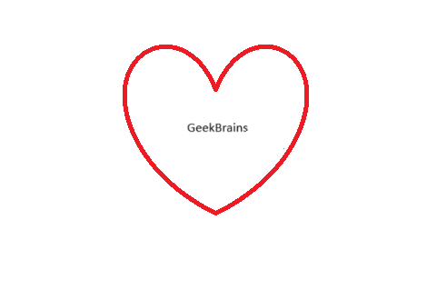

# Инструкция для работы с Markdown

## Выделение текста

Чтобы выделить текст курсивом, необходимо обрамить его звездочками(*) или знаком нижнего подчеркивания (-). Например: *вот так.* или _вот так._

Чтобы выделить текст полужирным, необходимо обрамить его двойными звездочками (**) или двойным нижним подчеркиванием (__). Например: **вот так** или __вот так.__.

Альтернативные способы выделения текста  нужны для того, чтобы мы могли совмещать оба этих способа.  Например:
_Текст может быть выделен курсивом и при этом быть **полужирным.**_

## Списки
Чтобы добавить ненумерованные списки, нужно пункты обрамить звездочкой (*). Например:

* Элемент 1
* Элемент 2
* Элемент 3

Чтобы добавить нумерованные списки, необходимо пункты просто пронумеровать. Например:

1. Первый пункт
2. Второй пункт

## Работа с изображениями

Чтобы вставить изображение в текст, достаточно сделать следующее:

## Ссылки

## Работа с таблицами

## Цитаты

## Заключение